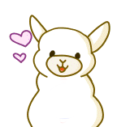

# Alpagotchi | Alpaca + Tamagotchi

Alpagotchi allows any user to create and take care of their own alpaca.  \
Items can be bought to satisfy hunger and thirst and work can be done to earn money for the items.

## Commands

`Default prefix: a!`

### Admin Commands

| Usage        | Aliases        | Task           | 
| -------------| ---------------| ---------------| 
| setprefix [prefix] | - | Sets the prefix of the guild |
| setbalance [@user] [balance] | - | Sets the balance of the mentioned user |

### Member Commands

| Usage        | Aliases        | Task           | 
| -------------| ---------------| ---------------| 
| buy [itemName] [1-10] | - | Buys the amount of items from the shop |
| feed [itemName] [1-5] | - | Feeds the alpaca with the item |
| gift [@user] [itemName] [1-5] | - | Gifts the amount of items to the mentioned user |
| help [command] | commands | Displays further information to the specified command |
| inventory | inv | Shows the bought items from the shop |
| myalpaca | ma, stats, alpaca | Shows your alpaca and his stats |
| nick [nickname] | - | Gives your alpaca a nickname |
| pet | - | Increases joy of your alpaca |
| shop | - | Displays all items which can be bought |
| wallet | balance, money | Shows your balance of fluffies |
| work | - | Work to earn a random amount of fluffies |
| sleep [minutes] | - | Let your alpaca sleeps  and regenerates energy |
| outfit [outfit] | - | Change the appearance of your alpaca |
