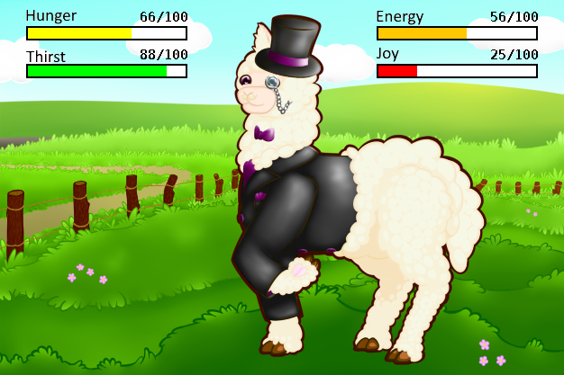

<h1 align="center">Alpagotchi</h1>

<div align="center">
     
     
     
    
</div>

<h3 align="center">Alpagotchi allows any user to create and take care of their own digital alpaca.</h3><br>

<div align="center">
    
</div>

## Table of Contents
1. [Commands overview](#commands-overview)
2. [Self-hosting](#self-hosting)
3. [Useful links](#useful-links)

## Commands overview
| Usage                         | Task                                            |
|-------------------------------|-------------------------------------------------|
| buy [itemName] [1-10]         | Buys the amount of items from the shop          |
| feed [itemName] [1-5]         | Feeds the alpaca with the item                  |
| gift [@user] [itemName] [1-5] | Gifts the amount of items to the mentioned user |
| help                          | Displays all commands of Alpagotchi             |
| inventory                     | Shows the bought items from the shop            |
| alpaca                        | Shows your alpaca and his stats                 |
| nick [nickname]               | Gives your alpaca a nickname                    |
| pet                           | Increases joy of your alpaca                    |
| shop                          | Displays all items which can be bought          |
| balance                       | Shows your balance of fluffies                  |
| work                          | Work to earn a random amount of fluffies        |
| sleep [minutes]               | Let your alpaca sleep and regenerates energy    |
| outfit [outfit]               | Change the appearance of your alpaca            |
| delete                        | Deletes all of your stored data                 |
| init                          | Initialize your alpaca in the database          |
| language                      | Sets the bots' language within a guild          |

## Self-hosting
Alpagotchi provides a docker image to host it yourself. The docker image can be found on [dockerhub](https://hub.docker.com/r/alpagotchi/discord-bot).

> [!IMPORTANT]
> This directory structure is needed for Alpagotchi to run:
> ```
> /
> ├── docker-compose.yml
> └── .env
> ```
 
The `.env` file needs the following entries:

````
TOKEN=                      # the bot token
OWNER_ID=                   # your discord user id

# if you leave the version variables empty, Alpagotchi uses default values
POSTGRES_VERSION=
ADMINER_VERSION=
ALPAGOTCHI_VERSION=

POSTGRES_USER=              # the database username of your choice
POSTGRES_PASSWORD=          # the database password of your choice
POSTGRES_URL=               # the jdbc url of the postgres database
POSTGRES_DB=                # the database name of your choice
````

The `docker-compose.yml` configures the following services:
- postgres database for data storage
- the discord bot
- adminer for accessing the database via GUI

````yml
version: '3.8'

name: alpagotchi
services:
  database:
    image: postgres:${POSTGRES_VERSION:-15.4}
    restart: on-failure
    environment:
      POSTGRES_USER: ${POSTGRES_USER}
      POSTGRES_PASSWORD: ${POSTGRES_PASSWORD}
      POSTGRES_DB: ${POSTGRES_DB}
    volumes:
      - pg-data:/var/lib/postgresql/data
    ports:
      - "5432:5432"
        
  bot:
    container_name: bot
    image: alpagotchi/discord-bot:${ALPAGOTCHI_VERSION:-0.0.1}
    depends_on:
      - database
    restart: on-failure
    environment:
      TOKEN: ${TOKEN}
      OWNER_ID: ${OWNER_ID}
      POSTGRES_USER: ${POSTGRES_USER}
      POSTGRES_PASSWORD: ${POSTGRES_PASSWORD}
      POSTGRES_URL: ${POSTGRES_URL}

  adminer:
    image: adminer:${ADMINER_VERSION:-4.8.1}
    depends_on:
      - database
    restart: on-failure
    environment:
      ADMINER_DESIGN: pepa-linha-dark
    ports:
      - "8080:8080"

volumes:
  pg-data:
````

## Useful links
- [Official Alpagotchi website](https://alpagotchi.github.io) 
- [Discord invite link of the Alpagotchi bot](https://discord.com/api/oauth2/authorize?client_id=780910199875567616&permissions=265216&scope=bot%20applications.commands)
- [Discord invite link of the support server](https://discord.gg/DXtYyzGhXR)
- [Top.gg page of Alpagotchi](https://top.gg/bot/780910199875567616)
