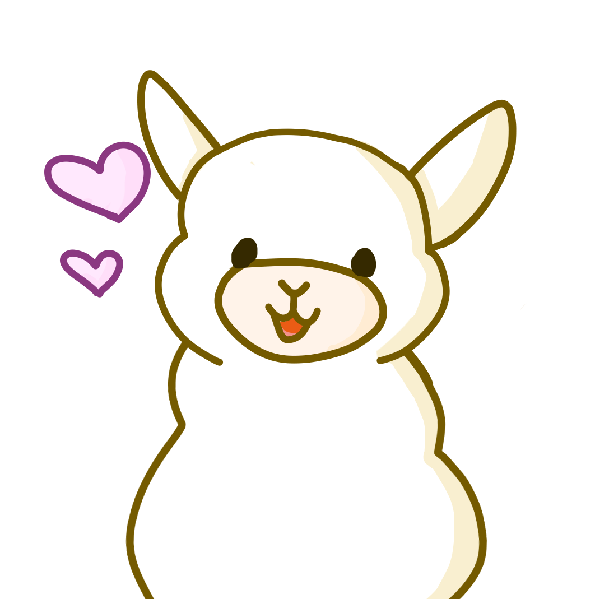

  
  

<h1>
  Alpagotchi
</h1>

  Alpagotchi (Alpaca + Tamagotchi) allows any user to create and take care of an individual alpaca. 
  Items can be bought to satisfy hunger and thirst and work can be done to earn money for the items.

<h2>
  Commands
</h2>
<h3>
  Developer Commands
</h3>
<table style="width:100%">
  <tr>
    <th>Usage</th>
    <th>Task</th>
  </tr>
  <tr>
    <td>a!decrease [enable | disable]</td>
    <td>Determines if the alpaca loses stats or not</td>
  </tr>
  <tr>
    <td>a!shutdown</td>
    <td>Shutdowns the bot</td>
  </tr>
</table>
<h3>
  Admin Commands
</h3>
<table style="width:100%">
  <tr>
    <th>Usage</th>
    <th>Task</th>
  </tr>
  <tr>
    <td>a!setprefix [prefix]</td>
    <td>Sets the prefix of the guild </td>
  </tr>
</table>
<h3>
  Member Commands
</h3>
<table style="width:100%">
  <tr>
    <th>Usage</th>
    <th>Task</th>
  </tr>
  <tr>
    <td><b>a!buy [itemname] [1-10]</b></td>
    <td> Buys the amount of items from the shop </td>
  </tr>
  <tr>
    <td><b>a!feed [itenname]</b></b></td>
    <td>Feeds the alpaca with the item </td>
  </tr>
</table>

  
  
  <b>a!gift [@User] [itemname] [1-5]</b> Gifts the amount of items to the mentioned user 
  <b>a!help</b> Displays all avaiable commands 
  <b>a!inventory</b> Shows the bought items from the shop 
  <b>a!myalpaca</b> Shows your alpaca and his stats 
  <b>a!nick [nickname]</b> Gives your alpaca a nickname 
  <b>a!pet</b> Sends a GIF and pets your alpaca 
  <b>a!shop</b> Displays all items, which can be bought 
  <b>a!wallet</b> Shows your bhalance of fluffies 
  <b>a!work</b> Work to earn a random amount of fluffies 

